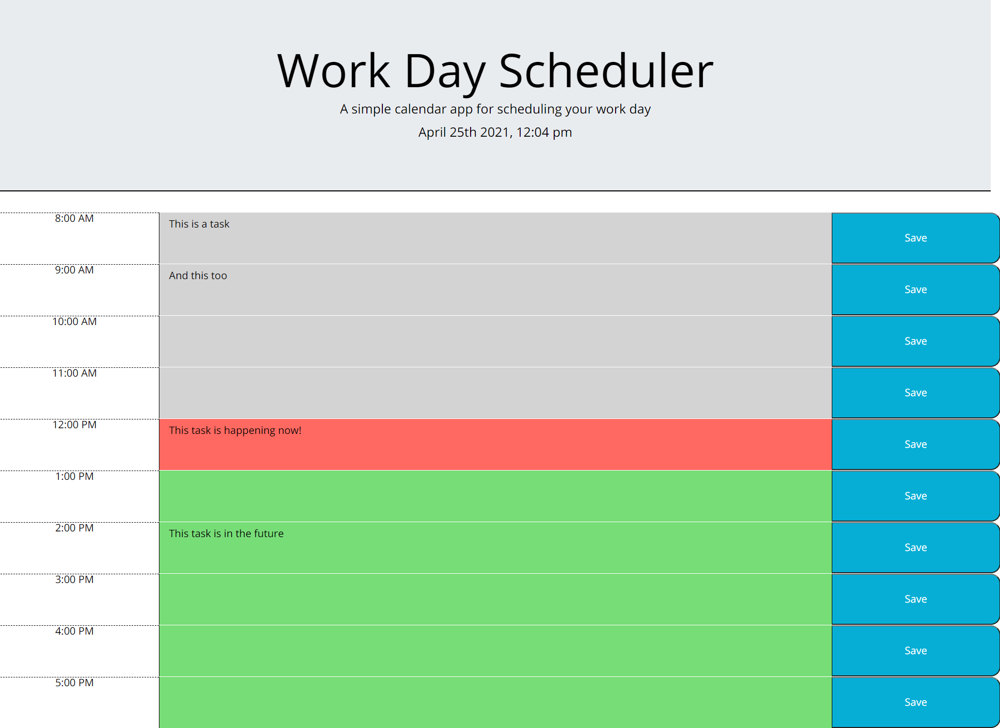

# Work Day Scheduler

## Table of Contents
* [Deployed](#deployed)
* [Description](#description)
* [Technologies](#technologies)
* [Usage](#usage)
* [Preview](#preview)
* [Credits](#credits)

## Deployed
https://sarawrmas.github.io/work-calendar/

## Description
Keep track of your work day in an hourly task breakdown. Get notified when a time slot is nearing so you never miss a deadline.

## Technologies
* HTML
* CSS
* JavaScript
* Jquery
* Moment.js
* Bootstrap

## Usage
To enter a task for a time slot, click inside that time slot's blank space and begin typing. Hit the save button on the right side and your entry will be saved to local storage so that it's still there on page load.

To delete a task, click inside the time slot's entry, remove the text, and hit save to update.

The hourly breakown is color coded so you always know what time slot you are in. Time slots that have already occurred for the day will appear in gray. The current time slot appears in red, notifying you to take care of any tasks that need to be completed right now. Future times appear in green, notifying you that they are coming up and to prepare accordingly.

If you're not sure what time it is exactly, refer to the top of the screen where the current time is displayed under the header.

## Preview

## Credits
Sara Adamski